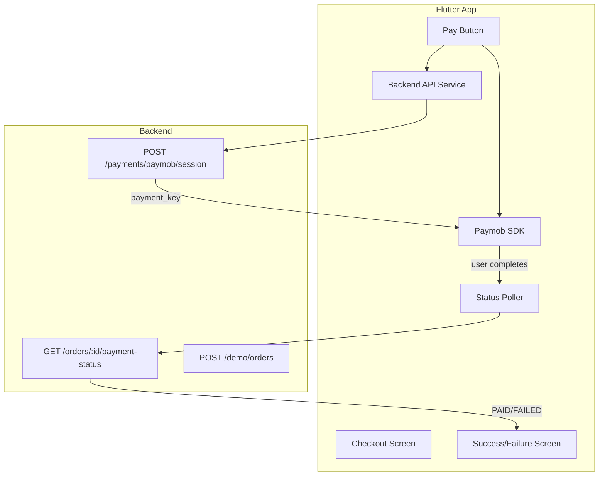

# Flutter Paymob Demo App Plan

## Architecture Overview




---

## 1. Project Setup

- Run `flutter create .` in the workspace to scaffold a Flutter app (directory is currently empty)
- Add dependencies in `pubspec.yaml`:
  - `dio: ^5.x` (or `http: ^1.x`) for REST calls
  - `paymob_flutter_lib: ^1.0.9` for native card payment with `payment_key` only

**Package choice note:** `paymob_flutter_lib` exposes `startPayActivityNoToken(Payment(paymentKey: ...))`, which accepts only the `payment_key` from your backend—no API keys in the app. It uses the native Paymob SDK and card UI. Its README targets paymob.pk; compatibility with Accept Egypt (accept.paymob.com) must be verified. If incompatible, the fallback is a minimal custom Flutter plugin wrapping [PaymobAccept/Android-SDK](https://github.com/PaymobAccept/Android-SDK) (which natively supports `payment_key`).

---

## 2. Configuration

Create `lib/config/api_config.dart`:

```dart
class ApiConfig {
  static const String baseUrl = String.fromEnvironment(
    'API_BASE_URL',
    defaultValue: 'http://10.0.2.2:3000',
  );
}
```

For iOS simulator / physical device, use build flags or a simple env switch:

```dart
// Example: kDebugMode ? 'http://localhost:3000' : 'http://10.0.2.2:3000'
// Or detect platform and use appropriate URL
```

Recommended: Use a single constant with clear comments for switching (10.0.2.2 for Android emulator, localhost/LAN IP for iOS/physical).

---

## 3. Backend API Service

Create `lib/services/payment_api_service.dart`:

- `Future<SessionResponse> createPaymobSession(SessionRequest request)` → POST `/payments/paymob/session`
- `Future<PaymentStatusResponse> getPaymentStatus(String merchantOrderId)` → GET `/orders/:merchant_order_id/payment-status`
- `Future<String> getDemoOrderId()?` → POST `/demo/orders` (optional)

Data classes:

- `SessionRequest`: `merchant_order_id`, `amount_cents`, `currency`, `customer`, `billing`
- `SessionResponse`: `merchant_order_id`, `paymob_order_id`, `payment_key`, `status`
- `PaymentStatusResponse`: `status`, `amount_cents`, `currency`, `paymob_order_id`, `updatedAt`

Use `Dio` (base URL from `ApiConfig`) with JSON encoding/decoding.

---

## 4. Checkout Screen

Create `lib/screens/checkout_screen.dart`:

- Text fields: amount (cents or EGP), customer (email, first_name, last_name, phone)
- “Pay” button
- Loading state while creating session and launching SDK
- Error handling for API failures
- Optional: “Get Demo Order” to call POST `/demo/orders` and pre-fill `merchant_order_id`

Default billing: apartment/floor/street/building = `"NA"`, city = `"Cairo"`, state = `"Cairo"`, country = `"EG"`, postal_code = `"00000"`.

---

## 5. Payment Flow Logic

In `checkout_screen.dart` or a dedicated `lib/services/payment_flow_service.dart`:

1. On “Pay” tap:
  - Validate inputs
  - Call `createPaymobSession` with order + customer + billing
  - If success, call `PaymobFlutterLib().startPayActivityNoToken(Payment(paymentKey: session.paymentKey, ...))`
2. On SDK return (success, failure, or user back):
  - Start polling `getPaymentStatus(merchant_order_id)` every 2–3 seconds
  - Stop when `status == "PAID"` or `status == "FAILED"` (or after max attempts, e.g. ~60s)
3. Navigate to success or failure screen based on final status

Handle SDK cancellation (user taps back): treat as non-success and either poll once to confirm or show a “Payment cancelled” message without polling.

---

## 6. Success / Failure Screens

- `lib/screens/payment_success_screen.dart`: show success message, amount, optional order info, button to return to checkout
- `lib/screens/payment_failure_screen.dart`: show failure message, optional retry button

Both receive status data (and optionally `merchant_order_id`, `amount_cents`, etc.) via constructor or `ModalRoute.of(context)?.settings.arguments`.

---

## 7. Main App Structure

- `main.dart`: `MaterialApp` with routes for `/`, `/checkout`, `/success`, `/failure` (or equivalent)
- `lib/app.dart` (optional): shell widget with navigation
- Home screen can directly show the checkout form or a simple “Start Payment” button that navigates to checkout

---

## 8. Platform Configuration

**Android** (`android/app/src/main/AndroidManifest.xml`):

```xml
<uses-permission android:name="android.permission.INTERNET" />
```

Ensure `android:usesCleartextTraffic="true"` in `application` (or in network security config) for `http://10.0.2.2:3000` during development.

**iOS** (`ios/Runner/Info.plist`):

- Add `NSAppTransportSecurity` → `NSAllowsArbitraryLoads: true` (or more restrictive `NSExceptionDomains` for your backend) for HTTP during development

**paymob_flutter_lib** (from README):

- Android: `tools:replace="android:label,android:supportsRtl"` in manifest if needed
- iOS: `platform :ios, '12.0'` and `EXCLUDED_ARCHS[sdk=iphonesimulator*] = "arm64"` in Podfile if required for your setup

---

## 9. Optional Enhancements

- Call POST `/demo/orders` before session creation to get `merchant_order_id` when “Get Demo Order” (or similar) is used
- Show a loading overlay/spinner during polling with a “Checking payment status...” message
- Wrap SDK launch in try-catch and handle `PlatformException` for user cancellation/back to avoid crashes

---

## File Structure

```
lib/
├── main.dart
├── app.dart                    # Optional: MaterialApp + routes
├── config/
│   └── api_config.dart
├── models/
│   ├── session_request.dart
│   ├── session_response.dart
│   └── payment_status_response.dart
├── services/
│   ├── payment_api_service.dart
│   └── payment_flow_service.dart   # Optional: encapsulates flow logic
├── screens/
│   ├── checkout_screen.dart
│   ├── payment_success_screen.dart
│   └── payment_failure_screen.dart
android/... (add INTERNET, cleartext)
ios/... (add ATS exception)
pubspec.yaml
```

---

## Key Implementation Details


| Requirement              | Implementation                                                    |
| ------------------------ | ----------------------------------------------------------------- |
| Backend URL configurable | `ApiConfig.baseUrl` constant                                      |
| No Paymob secrets in app | Only `payment_key` from session response passed to SDK            |
| Native SDK (no WebView)  | `paymob_flutter_lib` with `startPayActivityNoToken`               |
| Poll until PAID/FAILED   | 2–3s interval, max ~20–30 polls                                   |
| Loading state            | `CircularProgressIndicator` or overlay during API + polling       |
| Handle SDK back          | `PlatformException` / null result; show “cancelled” without crash |


